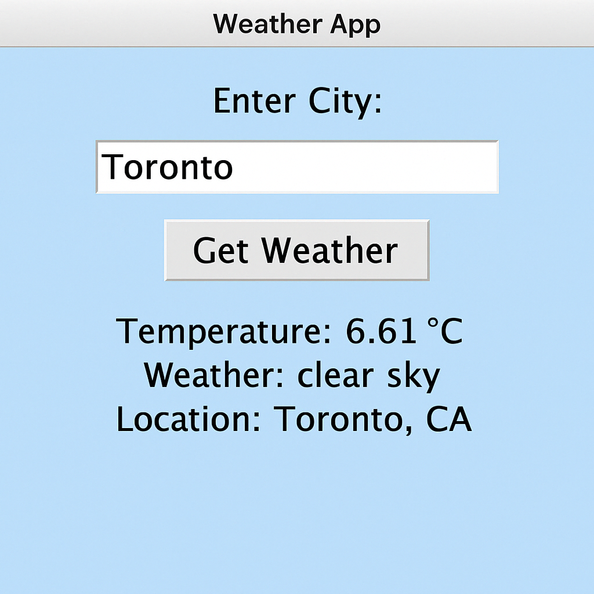

# 🌦 Weather App (Python GUI)

## 📸 Screenshot



A simple weather app built using Python and the OpenWeatherMap API. Enter any city name and get live weather updates including temperature and conditions. Data is also saved to a log file for reference.

---

## 🧰 Tech Stack
- Python 3
- Tkinter (GUI)
- Requests (API calls)
- OpenWeatherMap API

---

## 🛠 Setup Instructions

### 1. Replace the API Key
- Sign up at [OpenWeatherMap](https://openweathermap.org/api)
- Get your free API key
- Open `weather_app.py` and replace:
  ```python
  API_KEY = "your_api_key_here"
  

2. Run the App
 python weather_app.py

🚀 Usage
Enter a city name

Click “Get Weather”

The result will:

Display on the GUI

Save automatically to weather_log.txt

